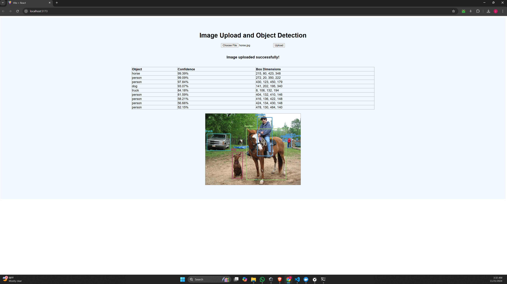

# Object Detection Application

This project is an object detection application built using **FastAPI** for the backend and **React.js** for the frontend. It allows users to upload an image, detect objects in the image, and view the results in a visually enhanced format, including the processed image and a table showing detected labels, confidence scores, and bounding box dimensions.

## Features
- Upload an image via the frontend.
- Backend processes the image and detects objects using the custom object detection model.
- Outputs:
  - The image with bounding boxes drawn around detected objects.
  - A table displaying:
    - **Labels**: The objects detected.
    - **Confidence**: The accuracy of the detection.
    - **Box Dimensions**: The coordinates of the bounding boxes.

---

## Getting Started

### Prerequisites
- **Docker** installed on your machine.
- **Node.js** and **npm** installed for the frontend.

---

## Setup Instructions

### 1. Backend Setup
The backend uses **FastAPI** to handle the object detection and API requests.

1. Build the Docker image:
   ```bash
   docker build -t object-detection-app .
   ```

2. Run the Docker container:
   ```bash
   docker run -p 8000:8000 object-detection-app
   ```

   The backend server will start and listen on `http://127.0.0.1:8000`.

---

### 2. Frontend Setup
The frontend is built with **React.js** and provides the UI for uploading images and displaying results.

1. Navigate to the `frontend` directory:
   ```bash
   cd frontend
   ```

2. Install dependencies:
   ```bash
   npm i
   ```

3. Start the development server:
   ```bash
   npm run dev
   ```

   The frontend will start, typically on `http://127.0.0.1:5173`.

---

## Usage

1. Open the frontend in your browser (default: `http://127.0.0.1:5173`).
2. Upload an image using the provided file input.
3. The backend will process the image and return:
   - An updated image with bounding boxes around detected objects.
   - A table with the detected objects, their confidence scores, and bounding box dimensions.

---

## Example Output

### Processed Image
The uploaded image is returned with bounding boxes drawn around detected objects.


### Detection Table

| **Object** | **Confidence** | **Box Dimensions**  |
|------------|----------------|----------------------|
| Horse      | 99.39%         | 215, 80, 423, 348   |
| Person     | 99.09%         | 272, 20, 350, 222   |
| Person     | 97.84%         | 430, 123, 450, 179  |
| Dog        | 93.07%         | 141, 202, 195, 340  |
| Truck      | 84.18%         | 8, 106, 132, 194    |
| Person     | 81.59%         | 404, 132, 410, 146  |
| Person     | 58.21%         | 416, 136, 422, 148  |
| Person     | 56.66%         | 424, 134, 430, 148  |
| Person     | 52.15%         | 478, 130, 484, 140  |


---

## Notes
- Ensure that the backend is running before starting the frontend.
- You may need to modify the backend URL in the frontend `axios` calls if the server runs on a different address.

---

## License
jaishivawasthi49@gmail.com
